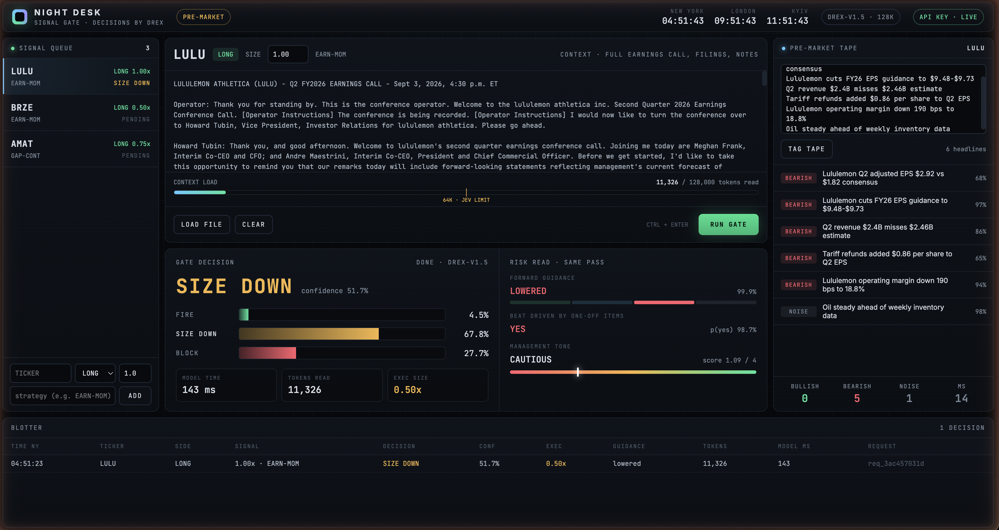
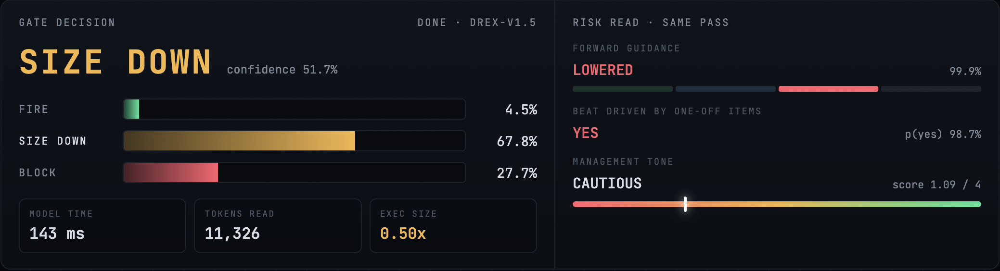
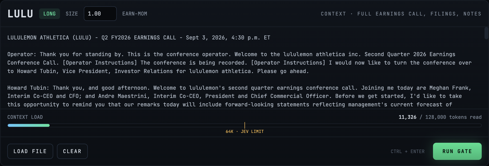
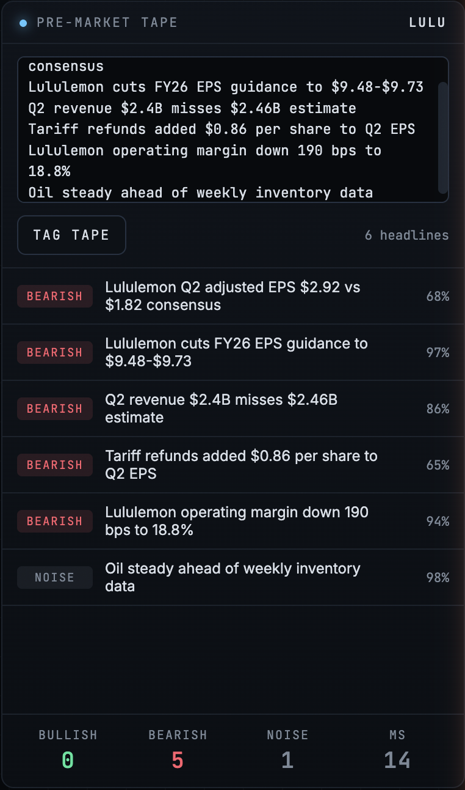
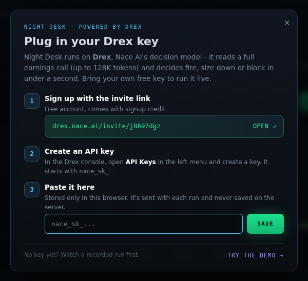

# Night Desk

**A quant desk that gates trading signals with [Drex](https://www.nace.ai/drex) by Nace AI.**
It reads a full earnings call in one pass and decides - fire, size down, or block - in well under a second.



**▶ Try it live:** `https://<your-app>.onrender.com` - no key needed for the demo. Want to run it on your own text? [Get a free Drex key](https://drex.nace.ai/invite/j8697dgz).

---

## Why

A momentum model sees a headline beat and fires a long. The headline doesn't tell it that the beat came from a one-off tariff refund, or that the CFO cut full-year guidance forty minutes into the Q&A.

Night Desk puts a decision model between the signal and execution. Before an order goes out, [Drex](https://www.nace.ai/drex) reads everything the desk has on the name - the whole call, the press release, prior quarters - and answers one question: **what should happen to this signal?**

Drex is built for exactly this. It doesn't write text. You give it a state and a set of options, and one forward pass returns a calibrated probability for every option. No token stream, no JSON to repair, and it can't invent an option you didn't offer.

## A real run

Lululemon, Q2 FY2026 (Sept 3, 2026). Adjusted EPS came in at **$2.92 vs $1.82** consensus - a headline beat. A long signal fires at 1.00x.

Night Desk passes the full earnings call transcript to Drex:



| | |
|---|---|
| **Decision** | **SIZE DOWN** → executes at 0.50x |
| Probabilities | size down 67.8% · block 27.7% · fire 4.5% |
| Forward guidance | **lowered** (99.9%) |
| Beat driven by one-off items | **yes** (98.7%) - $0.86/share came from tariff refunds |
| Management tone | cautious (1.09 / 4) |
| Model time | **143 ms** for 11,326 tokens |

The stock fell more than 17% in pre-market trading the next morning.

> This is a replay of a past call, not a live trade. Drex may have seen public information about the outcome. Treat it as a demo of the workflow, not a backtest.

## What's on the desk

**Signal queue** - incoming signals with ticker, side, size multiplier and strategy tag. Each one shows its gate status once decided.

**Context** - paste or drop in anything the desk knows about the name: the earnings call, press release, prior calls, 10-Q notes. A load meter shows how much you've given it against Drex's 128K window, with Jev's 64K request limit marked.



**Gate decision** - one Drex call answers four questions about the same context:

| Key | Type | Question |
|---|---|---|
| `gate` | choice | Fire / size down / block this signal? |
| `guidance` | choice | Did management raise, maintain, lower or skip guidance? |
| `one_off` | yes/no | Was the headline beat driven by one-time items? |
| `tone` | score | How confident did management sound? (very cautious → very confident) |

The desk maps the verdict to an execution size: **fire** = 1.0x, **size down** = 0.5x, **block** = 0x of the signal's size.

**Pre-market tape** - paste headlines and Drex tags each one bullish, bearish or noise for the position. Headlines go 20 per call, each as its own question.

<p align="center"></p>

**Blotter** - every decision with time, verdict, confidence, execution size, token count, model time and request ID.

## Get a Drex key

1. Sign up with the invite link: **[drex.nace.ai/invite/j8697dgz](https://drex.nace.ai/invite/j8697dgz)** - free, with signup credit.
2. In the Drex console, open **API Keys** and create a key (it starts with `nace_sk_`).
3. Paste it into Night Desk. The first time you open the desk without a key, it walks you through this:

<p align="center"></p>

Your key is stored only in your browser and sent with each run. The server forwards it to Drex and never stores or logs it. No key yet? Hit **Try the demo** - it replays the real LULU run above.

## Quick start

You need Python 3.9+ (standard library only - nothing to install). Setting `DREX_API_KEY` is optional - without it, the desk asks for a key in the browser.

**macOS / Linux**

```bash
git clone https://github.com/<you>/night-desk.git
cd night-desk
export DREX_API_KEY="nace_sk_..."
python3 server.py
```

Or double-click `run.command` - it asks for the key and starts the desk. (First time: `chmod +x run.command`, then right-click → Open if macOS warns about it.)

**Windows (PowerShell)**

```powershell
git clone https://github.com/<you>/night-desk.git
cd night-desk
$env:DREX_API_KEY = "nace_sk_..."
python server.py
```

Or run `.\run.ps1`.

The desk opens at **http://localhost:8765**. The key chip in the top right reads `LIVE` once a key is set - click it any time to change or remove your key.

## Walkthrough

1. **Pick a signal** in the queue, or add one at the bottom left (`TICKER`, side, size, strategy → **Add**).
2. **Load context.** Paste an earnings call transcript into the center panel, or drop `.txt` files onto it. You can stack several documents - each file gets a `=== filename ===` header.
3. **Run Gate** (or `Ctrl/Cmd + Enter`). The verdict, probabilities and risk read fill in; the signal's status updates in the queue and a row lands in the blotter.
4. **Tag the tape** (optional). Paste headlines into the right panel, one per line, and hit **Tag Tape**.

Sample headlines for the two reference cases are in [`examples/`](examples/). They were written from the reported numbers, not copied from a wire.

### Getting transcripts

Transcripts aren't included in this repo - they're copyrighted by whoever publishes them. Any public transcript works. For Motley Fool pages, [`tools/extract-transcript.js`](tools/extract-transcript.js) strips the page down to just the call:

1. Open the transcript page and the browser console (`Cmd+Option+J` / `Ctrl+Shift+J`).
2. Paste the script and press Enter. The page becomes one text box with the call already selected.
3. Copy, then paste into Night Desk.

Keep local transcripts in a `transcripts/` folder - it's git-ignored.

### Reference cases

| Case | Why it's interesting |
|---|---|
| **LULU** Q2 FY2026 (Sept 3, 2026) | Headline EPS beat, but it leaned on tariff refunds and guidance was cut. Stock fell 17%+ pre-market. |
| **SNOW** Q2 FY2027 (Sept 2, 2026) | Clean beat-and-raise: EPS $0.62 vs $0.45, product revenue +37%, FY guidance raised. Stock rose ~22% after hours. |
| **LULU**, eight calls (Aug 2024 → Sept 2026) | Around 85K tokens - past Jev's 64K request limit, inside Drex's 128K window. |

## Deploy

Night Desk is one Python file with no dependencies, so it runs on any host that can start `python server.py`. When the platform sets `PORT`, the server binds to `0.0.0.0` and skips opening a browser.

**Render (free tier, one click)**

1. Push this repo to GitHub.
2. On [render.com](https://render.com): **New + → Blueprint**, pick the repo. It reads [`render.yaml`](render.yaml).
3. Deploy. Your desk is live at `https://<name>.onrender.com`.

Free instances sleep when idle - the first visit after a while takes ~30 seconds to wake up.

**Railway / Fly.io / anything else** - start command `python server.py`, no build step. Health check: `/healthz`.

> **Don't set `DREX_API_KEY` on a public deployment.** It becomes the fallback for every visitor without a key, and your credits go with it. Leave it unset and visitors bring their own.

Built-in guardrails for public hosting:

- Per-IP rate limit (`RATE_LIMIT_PER_MIN`, default 30).
- Request size cap (`MAX_BODY_BYTES`, default ~2 MB - roughly Drex's 128K-token window).
- No server-side storage. Nothing about a visitor's key or text is written to disk or logs.

## How it works

```
 browser (desk.html)  ──POST /api/decide──▶  server.py  ──POST /v1/systemone──▶  Drex
        ▲                                      (adds key,                        (drex.nace.ai)
        └──────────── JSON answers ◀────────── model name) ◀──────────────────────┘
```

- `desk.html` is the whole UI - a single file, no build step, no framework.
- `server.py` serves it and forwards decision requests to Drex, with the visitor's key from the `X-Drex-Key` header (or `DREX_API_KEY` as a fallback when running locally).
- Every gate is a single request to `POST /v1/systemone`:

```json
{
  "model": "drex-v1.5",
  "state": "DESK SIGNAL\nTicker: LULU\nDirection: LONG\nSize: 1.00x\n...\n=== CONTEXT ===\n<full transcript>",
  "questions": {
    "gate": {
      "type": "choice",
      "instructions": "A long signal fired on LULU at 1.00x size. Given everything in the context, what should the desk do with this signal before it goes to execution?",
      "criteria": {
        "fire": "Send the long order at full size. The context supports the trade.",
        "size_down": "Send the long order at reduced size. The context is mixed or adds risk.",
        "block": "Cancel the order. The context contradicts the long thesis."
      }
    },
    "guidance": { "type": "choice", "instructions": "What did management do to forward guidance?", "criteria": { "raised": "...", "maintained": "...", "lowered": "...", "not_given": "..." } },
    "one_off":  { "type": "noul",   "instructions": "Was the headline earnings beat driven mainly by one-time or non-recurring items?" },
    "tone":     { "type": "score",  "instructions": "How confident did management sound about the next quarters?", "criteria": ["Very cautious", "Cautious", "Neutral", "Confident", "Very confident"] }
  }
}
```

The desk reads `answers.<key>.probabilities`, `evaluation_time_ms` and `usage.input_tokens` from the response. See the [Drex API docs](https://drex.nace.ai/docs) for the full schema.

To change what the desk asks, edit the `questions` object in `runGate()` inside `desk.html`.

## Configuration

| Variable | Default | |
|---|---|---|
| `DREX_API_KEY` | - | Optional fallback key. Handy locally - **leave unset when public**. |
| `DREX_MODEL` | `drex-v1.5` | Model name sent with each request. |
| `DREX_BASE` | `https://drex.nace.ai` | API base URL. |
| `PORT` | - | Set by hosting platforms. When present, binds to `0.0.0.0`. |
| `DREX_DESK_PORT` | `8765` | Local port when `PORT` isn't set. |
| `DREX_INVITE_URL` | invite link | Signup link shown in the key modal. |
| `RATE_LIMIT_PER_MIN` | `30` | Requests per IP per minute. `0` disables it. |
| `MAX_BODY_BYTES` | `2000000` | Largest request the server accepts. |
| `DREX_NO_BROWSER` | - | Set to `1` to skip opening a browser tab on start. |

## Project structure

```
night-desk/
├── desk.html                 the dashboard (single file)
├── server.py                 local server + Drex proxy (stdlib only)
├── run.command               macOS launcher
├── run.ps1                   Windows launcher
├── render.yaml               one-click Render deploy
├── examples/                 sample headline tapes
├── tools/
│   └── extract-transcript.js console helper for transcript pages
└── docs/                     screenshots
```

## Notes

- **Unofficial.** Not affiliated with or endorsed by Nace AI. Drex is a product of [Nace AI](https://www.nace.ai).
- **Not trading advice.** Night Desk is a demo of a signal-gating workflow. Nothing here places orders, and no output should be read as a recommendation to buy or sell anything.
- **Token counts.** The load meter estimates tokens at ~4 characters each before a run, then switches to the exact count Drex reports.
- **Costs.** Each gate is one request, billed on input tokens. A full earnings call runs roughly 10-15K tokens. Check current pricing on [nace.ai/drex](https://www.nace.ai/drex).

## License

[MIT](LICENSE)
